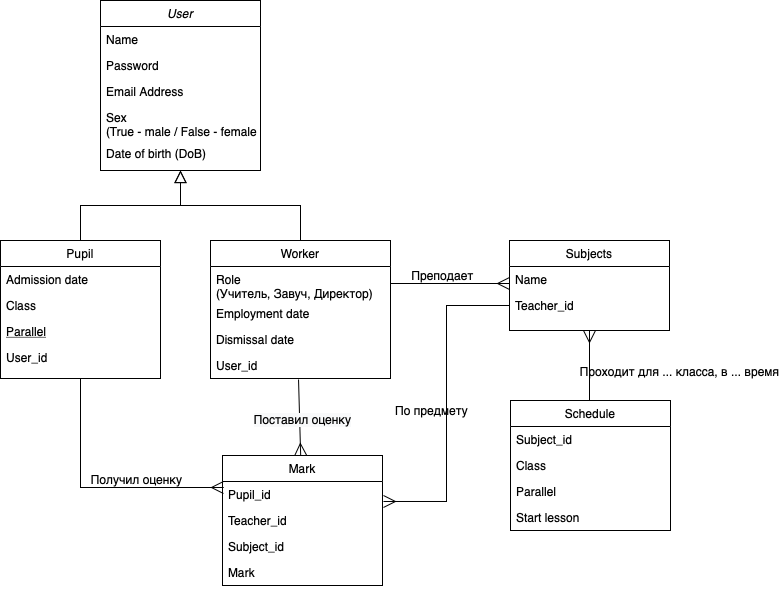

### Как запустить проект?
1. Скопировать проект
2. Настроить БД в файле .env/.env.example
3. Запустить установку всех необходимых пакетов composer update
3. Запустить сервер командой php artisan serve

### Структура базы данных

### Методы
|Описание|Метод и адрес|Параметры|Доступ|
|--------|:-----------:|---------|:----:|
|Получить список всех пользователей| GET /users|Нет| Все
|Зарегистрировать нового пользователя| POST /register| <li>name - ФИО</li><li>email - адрес электронной почты</li><li>password - пароль (с подтверждением)</li><li>DoB - дата рождения (формат: дд.мм.гггг)</li><li>sex - пол (True/False)</li>| Все
|Зайти в аккаунт пользователя | PUT /login | <li>email - электронная почта</li><li>password - пароль</li> | Все
|Выйти из аккаунта пользователя | GET /logout | Нет | Все
|Редактирование данных пользователя| PUT /users/{user} | <li>name - ФИО</li><li>DoB - дата рождения (формат: дд.мм.гггг)</li><li>sex - пол (True/False)</li> | Директор
|Удаление пользователя| DELETE /users/{user} | Нет | Директор
|Получить данные определенного пользователя| GET /users/{user}|Нет| Все
|Добавление пользователя в ученики | POST /users/add-to-pupil| <li>user_id - id пользователя (Пользователь не может состоять в учениках и сотрудниках)</li><li>admission_date - дата поступления</li><li>class - класс (от 0 до 11)</li><li>parallel - параллель (один символ)</li>| Директор
|Добавление пользователя в сотрудники | POST /users/add-to-worker| <li>user_id - id пользователя (Пользователь не может состоять в учениках и сотрудниках)</li><li>role - должность ("Учитель", "Завуч", "Директор")</li><li>employment_date - дата трудоустройства</li>| Директор
|Получить список учителей | GET /users/workers | Нет | Сотрудники
|Получить список учеников | GET /users/pupils | Нет | Сотрудники
|Уволить сотрудника | PUT /workers/{worker} | Нет | Директор
|Перевести ученика в другой класс | PUT /pupils/{pupil} | Нет | Директор
|Получить список учеников определенного класса | GET /users/class | <li>class - номер класса</li><li>parallel - параллель класса</li> | Сотрудники
|Создание нового предмета | POST /subjects | <li>name - наименование предмета</li><li>teacher_id - id сотрудника, который проводит занятия по данному предмету</li> | Сотрудники
|Изменение предмета| PUT /subjects/{subject} | <li>name - наименование предмета</li><li>teacher_id - id сотрудника, который проводит занятия по данному предмету</li> | Сотрудники
|Удаление предмета| DELETE /subjects/{subject} | Нет | Сотрудники
|Получить список всех предметов| GET /subjects | Нет | Сотрудники
|Получить предмет| GET /subjects/{subject} | Нет | Сотрудники
|Добавление предмета в расписание | POST /schedules/{schedule} | <li>subject_id - id предмета</li><li>class - класс, которому преподается предмет</li><li>parallel - параллель класса</li><li>start_lesson - время и дата начала занятия (формат: дд.мм.гггг ЧЧ:ММ)</li> | Сотрудники
|Получить список всех предметов в расписании | GET /schedules | Нет | Сотрудники
|Удалить предмет из расписания| DELETE /schedules/{schedule} | Нет | Сотрудники
|Изменить предмет в расписании| PUT /schedules/{schedule} | <li>class - класс, которому преподается предмет</li><li>parallel - параллель класса</li><li>start_lesson - время и дата начала занятия (формат: дд.мм.гггг ЧЧ:ММ)</li> | Сотрудники
|Получить определенный предмет в расписании| GET /schedules/{schedule} | Нет | Сотрудники
|Получить расписание для сотрудника | GET /workers/{worker}/schedule | Нет | Сотрудники
|Получить расписание для класса | GET class/schedule | <li>class - класс</li><li>parallel - параллель класса</li> | Все
|Выставить оценку | POST /marks | <li>subject_id - id предмета</li><li>teacher_id - id преподавателя</li><li>pupil_id - id ученика</li><li>mark - оценка (от 1 до 5)</li>| Сотрудники
|Изменить оценку | PUT /marks | <li>subject_id - id предмета</li><li>teacher_id - id преподавателя</li><li>pupil_id - id ученика</li><li>mark - оценка (от 1 до 5)</li>| Сотрудники
|Удалить оценку | DELETE /marks/{mark} | Нет | Сотрудники
|Показать все оценки | GET /marks | Нет | Сотрудники
|Показать определенную оценку | GET /marks/{mark} | Нет | Сотрудники
|Показать среднюю оценку, количество оценок и все оценки определенного класса| GET /marks/class | <li>class - номер класса</li><li>parallel - параллель класса</li> | Сотрудники
|Показать оценки определенного ученика| GET /pupils/{pupil}/marks | Нет | Сотрудники
|Показать все оценки поставленные определенным учителем| GET /workers/{worker}/marks | Нет | Директор
|Показать оценки за определенный предмет| GET /subjects/{subject}/marks | Нет | Сотрудники
